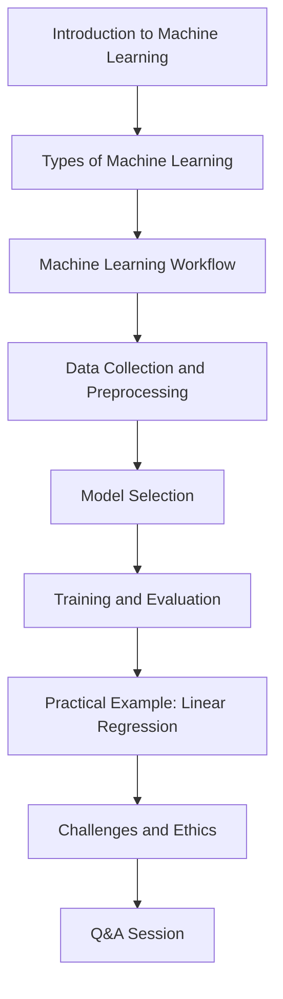

# Simple Example: Analyzing a Lecture Video

This example demonstrates how to use SmolaVision to analyze a lecture video and generate a summary of the content.

## The Video

For this example, we'll use a lecture video about machine learning. The video is 45 minutes long and features a presenter explaining concepts with slides.

## Step 1: Basic Analysis

Let's start with a basic analysis using the default settings:

```bash
smolavision --video lecture.mp4
```

This will:
- Extract frames every 10 seconds
- Analyze the frames using the default AI model
- Generate a summary of the lecture content

## Step 2: Improving the Analysis

The basic analysis might miss some details, so let's improve it:

```bash
smolavision --video lecture.mp4 --frame-interval 5 --detect-scenes --enable-ocr --language English
```

This will:
- Extract frames more frequently (every 5 seconds)
- Detect scene changes to capture slide transitions
- Enable OCR to extract text from slides
- Specify that the text is in English

## Step 3: Customizing the Output

Let's customize the output to focus on the educational content:

```bash
smolavision --video lecture.mp4 --frame-interval 5 --detect-scenes --enable-ocr --mission workflow --generate-flowchart
```

This will:
- Use the "workflow" mission to focus on the educational process
- Generate a flowchart of the lecture structure

## Example Output

### Summary

```
# Machine Learning Lecture Summary

This 45-minute lecture provides an introduction to machine learning concepts. The presenter covers the following topics:

1. Definition of machine learning and its applications
2. Types of machine learning: supervised, unsupervised, and reinforcement learning
3. The machine learning workflow: data collection, preprocessing, model selection, training, evaluation, and deployment
4. Common algorithms: linear regression, decision trees, neural networks
5. Practical examples using Python and scikit-learn
6. Challenges and ethical considerations in machine learning

The lecture includes slides with diagrams, code examples, and mathematical formulas. The presenter demonstrates a simple linear regression example and shows how to evaluate model performance using metrics like accuracy and mean squared error.
```

### Flowchart



## Step 4: Using a Local Model

If you want to analyze the video offline or avoid API costs, you can use a local model with Ollama. First, ensure the models are installed:

```bash
smolavision setup-ollama --models llama3,llava
```

Then run the analysis:

```bash
smolavision --video lecture.mp4 --model-type ollama --ollama-enabled --ollama-model llama3 --ollama-vision-model llava
```

This will use local models for both text generation and image analysis.

## Step 5: Processing a Long Video in Segments

If the lecture video is very long, you can process it in segments:

```bash
smolavision --video lecture.mp4 --pipeline-type segmented --segment-length 600
```

This will process the video in 10-minute segments (600 seconds) to manage memory usage.

## Conclusion

This example demonstrates how to use SmolaVision to analyze a lecture video and generate a summary of the content. By adjusting the parameters, you can customize the analysis to focus on different aspects of the video and generate different types of output.
