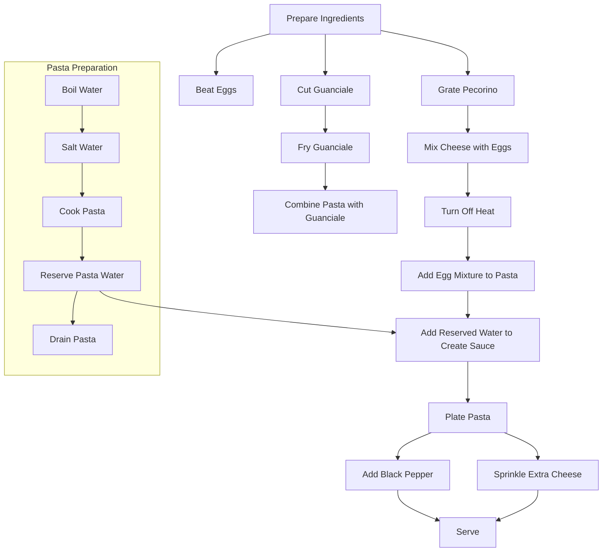

# Workflow Analysis Example: Analyzing a Cooking Tutorial

This example demonstrates how to use SmolaVision to analyze a cooking tutorial video and extract the workflow steps.

## The Video

For this example, we'll use a cooking tutorial video showing how to make pasta carbonara. The video is 15 minutes long and shows the entire cooking process from preparation to plating.

## Step 1: Basic Workflow Analysis

Let's start with a workflow-focused analysis:

```bash
smolavision --video carbonara_tutorial.mp4 --mission workflow
```

This will:
- Extract frames every 10 seconds
- Analyze the frames with a focus on workflow steps
- Generate a summary of the cooking process

## Step 2: Enhanced Workflow Analysis

To get a more detailed analysis, let's enhance the parameters:

```bash
smolavision --video carbonara_tutorial.mp4 --mission workflow --frame-interval 3 --detect-scenes --enable-ocr --generate-flowchart
```

This will:
- Extract frames more frequently (every 3 seconds)
- Detect scene changes to capture different cooking stages
- Enable OCR to extract any text overlays or measurements
- Generate a flowchart of the cooking workflow

## Example Output

### Summary

```
# Pasta Carbonara Tutorial Workflow Analysis

This cooking tutorial demonstrates how to make a traditional pasta carbonara. The workflow consists of the following main steps:

## Preparation Phase (0:00 - 3:45)
1. The chef introduces the dish and its origins
2. Ingredients are displayed: spaghetti, eggs, pecorino cheese, guanciale, black pepper
3. The chef prepares the ingredients by:
   - Cutting guanciale into small cubes
   - Grating pecorino cheese
   - Beating eggs and mixing with grated cheese

## Cooking Phase (3:46 - 11:30)
4. A pot of water is brought to a boil and salted
5. Spaghetti is added to the boiling water
6. In a separate pan, guanciale is fried until crispy
7. The pasta is cooked to al dente (about 8 minutes)
8. A small amount of pasta water is reserved
9. The pasta is drained
10. The drained pasta is added to the pan with guanciale
11. The heat is turned off
12. The egg and cheese mixture is added to the pasta and stirred quickly
13. A small amount of reserved pasta water is added to create a creamy sauce

## Finishing Phase (11:31 - 15:00)
14. The pasta is plated
15. Freshly ground black pepper is added on top
16. Additional grated pecorino is sprinkled over the dish
17. The chef tastes the dish and discusses the results

The workflow emphasizes the importance of timing, particularly turning off the heat before adding the egg mixture to prevent scrambling the eggs.
```

### Flowchart



## Step 3: Using a Local Model

If you want to analyze the video offline or avoid API costs, you can use a local model with Ollama. First, ensure the models are installed:

```bash
smolavision setup-ollama --models llama3,llava
```

Then run the analysis:

```bash
smolavision --video carbonara_tutorial.mp4 --mission workflow --generate-flowchart --model-type ollama --ollama-enabled --ollama-model llama3 --ollama-vision-model llava
```

## Step 4: Customizing the Analysis Focus

You can customize the analysis to focus on specific aspects of the workflow:

```bash
smolavision --video carbonara_tutorial.mp4 --mission workflow --generate-flowchart --custom-prompt "Analyze this cooking tutorial with a focus on techniques and tools used. For each step, identify the cooking technique, tools used, and approximate timing."
```

## Step 5: Extracting Ingredient Quantities (Requires Custom Prompt)

If you want to extract ingredient quantities, you need to enable OCR and provide a custom prompt to the model:

```bash
# Note: --custom-prompt is not a standard CLI argument, this requires programmatic usage or modifying the analysis prompt generation logic.
# Example CLI call enabling OCR:
smolavision --video carbonara_tutorial.mp4 --mission workflow --enable-ocr
# You would then need to modify smolavision/analysis/vision.py or use programmatically to add the custom prompt.
```

## Programmatic Usage

You can also use SmolaVision programmatically to analyze the workflow:

```python
from smolavision.pipeline.run import run_smolavision

result = run_smolavision(
    video_path="carbonara_tutorial.mp4",
    config={
        "video": {
            "frame_interval": 3,
            "detect_scenes": True,
            "enable_ocr": True
        },
        "analysis": {
            "mission": "workflow",
            "generate_flowchart": True,
            "custom_prompt": "Analyze this cooking tutorial and extract a detailed recipe with exact ingredient quantities and measurements."
        },
        "model": {
            "model_type": "anthropic",
            "api_key": "your_api_key"
        }
    }
)

# Print the summary
print(result["summary_text"])

# Save the flowchart to a file
with open("carbonara_workflow.mmd", "w") as f:
    f.write(result.get("flowchart_path", ""))
```

## Conclusion

This example demonstrates how to use SmolaVision to analyze a cooking tutorial video and extract the workflow steps. The workflow mission is particularly useful for procedural videos like cooking tutorials, DIY guides, and instructional videos.
